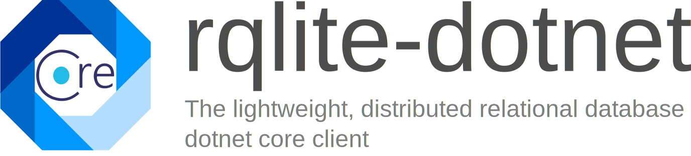

[](https://www.nuget.org/packages/RqLite.Client/)


# What is it?

A lightweight database dot net HTTP API client for rqlite. rqlite is a lightweight, distributed relational database, which uses SQLite as its storage engine. Forming a cluster is very straightforward, it gracefully handles leader elections, and tolerates failures of machines, including the leader. rqlite is available for Linux, OSX, and Microsoft Windows.

rqlite uses Raft to achieve consensus across all the instances of the SQLite databases, ensuring that every change made to the system is made to a quorum of SQLite databases, or none at all.

For more information visit the project

[](https://circleci.com/gh/rqlite/rqlite/tree/master) [](https://ci.appveyor.com/project/otoolep/rqlite) [](https://godoc.org/github.com/rqlite/rqlite) [](https://goreportcard.com/report/github.com/rqlite/rqlite) [](https://github.com/rqlite/rqlite/releases) [](https://hub.docker.com/r/rqlite/rqlite/) [](https://groups.google.com/group/rqlite)

https://github.com/rqlite/rqlite

# Quick Start

## Install NuGet

```
dotnet add package RqLite.Client --version 0.0.2-alpha
```

or visit the nuget for other options on: https://www.nuget.org/packages/RqLite.Client/


## Initialize a client

You can initialize the client with a single uri (single node operation), or if running a cluster you can provide multiple endpoints as illustrated below. The client will automatically look for the RAFT leader node.

```csharp
 var client = new RqLiteClient("http://localhost:4001,http://localhost:4002,http://localhost:4003");
```

## Perform an Execution

Executions can be used to execute sql statements such as "INSERT, "DROP TABLE foo" and "CREATE TABLE foo":

```csharp
var createTable = client.Execute("CREATE TABLE foo (id integer not null primary key, name text)");
var createFiona = await client.ExecuteAsync("INSERT INTO foo(name) VALUES(\"fiona\")");
```

## Perform a query

Queries are used for sql statements such as the "SELECT" query. You can either use sync or async calls:

```csharp
var readFiona = client.Query("SELECT * FROM FOO WHERE name=\"fiona\"");
var readFiona = await client.QueryAsync("SELECT * FROM FOO WHERE name=\"fiona\"");
```

## Setting multiple flags

rqlite provides three flags. 

* Flag for timings,showing execution time in the json query result
* Flag for pretty print, return pretty print json in the query result
* Flag for transaction, execution of multiple sql statements in one execution (as shown above)

These can be passed by the `RqLiteFlags` enum as a mask. To Enable all flags:

```csharp
RqLiteFlags maskAll =  (RqLiteFlags.Pretty | RqLiteFlags.Timings | RqLiteFlags.Transaction);
```

Then pass the mask into the Query or Execution path.

## Perform a transaction

You can perform multiple sql statements in one transaction. Please use the flag option:

```csharp
RqLiteFlags maskTransaction = RqLiteFlags.Transaction;
var transaction = await client.ExecuteAsync(new string[] {
    "INSERT INTO foo(name) VALUES(\"gary\")",
    "INSERT INTO foo(name) VALUES(\"fred\")"
}, maskTransaction);
```

### Parameterized Execute (since 0.0.2-alpha)

```csharp
var parameters = new object[] { "fiona", 20 };
var createFiona = await client.ExecuteAsync("INSERT INTO foo(name,age) VALUES(?,?)", parameters);
```

### Parameterized Query
```csharp
var parameters = new object[] { "fiona", 20 };
var readFiona = await client.QueryAsync("SELECT * FROM foo WHERE name=?", parameters[0] );
```

## Integration Tests

### Single rqlite Node

The project contains a couple of simple integration tests. To test, it suffices to start up a single node rqlite docker container.

```
docker run --name rqlite -p 4001:4001 -p4002:4002 rqlite/rqlite
```

This will spin up rqlite, with an in memory database with the service listening on port 4001. The raft will automatically
be upgraded to leader (from Follow state) on port 4002. This will be sufficient to do some easy integration tests.

```
            _ _ _
           | (_) |
  _ __ __ _| |_| |_ ___
 | '__/ _  | | | __/ _ \   The lightweight, distributed
 | | | (_| | | | ||  __/   relational database.
 |_|  \__, |_|_|\__\___|
         | |               www.rqlite.com
         |_|

[rqlited] 2021/01/29 23:29:02 rqlited starting, version v5.9.0, commit e9332ded2f4d9fa232cde2c670b876dcc53a5133, branch master
[rqlited] 2021/01/29 23:29:02 go1.14, target architecture is amd64, operating system target is linux
[rqlited] 2021/01/29 23:29:02 no preexisting node state detected in /rqlite/file/data, node may be bootstrapping
[rqlited] 2021/01/29 23:29:02 no join addresses set
[store] 2021/01/29 23:29:02 opening store with node ID 0.0.0.0:4002
[store] 2021/01/29 23:29:02 ensuring directory at /rqlite/file/data exists
[store] 2021/01/29 23:29:02 SQLite in-memory database opened
2021-01-29T23:29:02.591Z [INFO]  raft: initial configuration: index=0 servers=[]
[store] 2021/01/29 23:29:02 executing new cluster bootstrap
2021-01-29T23:29:02.592Z [INFO]  raft: entering follower state: follower="Node at [::]:4002 [Follower]" leader=
2021-01-29T23:29:04.499Z [WARN]  raft: heartbeat timeout reached, starting election: last-leader=
2021-01-29T23:29:04.499Z [INFO]  raft: entering candidate state: node="Node at [::]:4002 [Candidate]" term=2
2021-01-29T23:29:04.510Z [INFO]  raft: election won: tally=1
2021-01-29T23:29:04.510Z [INFO]  raft: entering leader state: leader="Node at [::]:4002 [Leader]"
[store] 2021/01/29 23:29:04 waiting for up to 2m0s for application of initial logs
[http] 2021/01/29 23:29:04 service listening on [::]:4001
[rqlited] 2021/01/29 23:29:04 node is ready

```

### rqlite 3 node cluster

The integration tests has a constant called: `CLUSTERTEST` defined in the RqLite.Client.Tests.cpsoj

```XML
  <PropertyGroup Condition="'$(Configuration)|$(Platform)'=='Debug|AnyCPU'">
    <DefineConstants>TRACE;DEBUG;CLUSTERTEST</DefineConstants>
  </PropertyGroup>
```

This allows you to write mixed tests, for either single or multi node tests. Consider the following
integration test as an example:

```csharp
        [Fact]
        [Trait("Category", "Integration")]
        public async void CanConnectToCluster()
        {
            var target = new RqliteRaftClient(connectionString);
            var nodes = await target.ConnectAsync();
#if CLUSTERTEST
            Assert.Equal(3, nodes.Count());
#else
            Assert.Equal(1, nodes.Count());
#endif
        }
```

To spin up a the 3 node cluster (without docker) with correct ports as used by the integration tests:

```
$ rqlited -node-id 1 -http-addr localhost:4001 -raft-addr localhost:4002 ./node1
$ rqlited -node-id 2 -http-addr localhost:4003 -raft-addr localhost:4004 -join http://localhost:4001 ./node2
$ rqlited -node-id 3 -http-addr localhost:4005 -raft-addr localhost:4006 -join http://localhost:4001 ./node3
```


